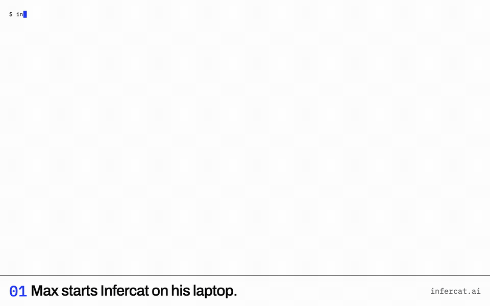

English · [简体中文](README.zh-CN.md)

<picture>
  <source media="(prefers-color-scheme: dark)" srcset="docs/media/mark-paper.svg">
  
</picture>

# Infercat

**Let friends chat with your GPU.**

[](LICENSE)
[](https://github.com/infercat/infercat/actions/workflows/ci.yml)

---

Share the model on your machine with friends. You run one binary in front of the inference server you already have — llama.cpp, llama-swap, vLLM, Ollama or LM Studio — and give each friend one invite code. They paste it into a web page and chat with your model: no account, no VPN, nothing to install. The connection is encrypted end to end; the relay in between sees ciphertext. You set limits per friend and see counts, never their conversations.



*Recorded from the real app: a friend's browser, through the relay, to a laptop running llama.cpp.*

## How it works

- **The host** runs `infercat serve`. It finds the inference server, opens a WireGuard tunnel to a relay, and serves a small gateway inside the tunnel: OpenAI-compatible, one key per friend.
- **The friend** opens the web app and pastes the invite. The app carries the tunnel's client side as WebAssembly, so the browser connects to your host directly — through the relay, encrypted end to end.
- **The tunnel** is [tailcat](https://github.com/tailscale/tailcat), Tailscale's open-source data plane without the control plane. There is no account on either side. The relay is a DERP server: public ones by default, or your own (`--derpmap-url`). Infercat is not affiliated with or endorsed by Tailscale Inc.

**Try it first:** open https://infercat.ai/try and you are chatting with our demo host (Qwen3.8 27B), no install.

## Quickstart (host)

You need an inference server running (llama.cpp, llama-swap, vLLM, Ollama or LM Studio; any OpenAI-compatible `/v1/chat/completions` works). Your friends need a browser.

**Optional — no engine yet?** [Install Ollama](https://ollama.com/download), then:

```sh
ollama serve &      # skip if the Ollama app is already running
ollama run gemma4
```

That downloads Gemma 4 (about 10 GB; needs 16 GB of memory; reads images) and opens a chat. Leave it running or type `/bye`; the engine stays up. `infercat serve` finds it.

<a id="no-engine-yet"></a>
<details>
<summary><b>Advanced engine configuration</b></summary>

The same small model, tuned for context and parallel slots on llama.cpp, Ollama, LM Studio and vLLM.

Pick one. This command downloads and starts a small model (Gemma 4 E2B, about 4 GB, runs on an 8 GB laptop, supports images):

**llama.cpp**

`brew install llama.cpp`

```sh
llama-server -hf unsloth/gemma-4-E2B-it-qat-GGUF:UD-Q4_K_XL -c 65536 -np 2 --host 127.0.0.1
```

**Ollama** — use `infercat serve --slots 2` below.

`brew install ollama`

```sh
(OLLAMA_CONTEXT_LENGTH=32768 OLLAMA_NUM_PARALLEL=2 ollama serve & until ollama list >/dev/null 2>&1; do sleep 1; done; ollama run hf.co/unsloth/gemma-4-E2B-it-qat-GGUF:UD-Q4_K_XL "" && wait)
```

**LM Studio** — use `infercat serve --slots 2` below.

[Install LM Studio](https://lmstudio.ai/download) and open it once.

```sh
~/.lmstudio/bin/lms get https://huggingface.co/unsloth/gemma-4-E2B-it-qat-GGUF/resolve/main/gemma-4-E2B-it-qat-UD-Q4_K_XL.gguf --yes && ~/.lmstudio/bin/lms load gemma-4-e2b-it-qat --context-length 32768 --parallel 2 --yes && ~/.lmstudio/bin/lms server start --port 1234
```

**vLLM** — not verified on macOS; needs a CUDA GPU

[Install vLLM](https://docs.vllm.ai/en/latest/getting_started/installation/gpu/)

```sh
vllm serve google/gemma-4-E2B-it-qat-w4a16-ct --host 127.0.0.1 --max-model-len 32768 --max-num-seqs 2
```

</details>

```sh
curl -fsSL https://infercat.ai/install.sh | sh    # macOS or Linux
brew install infercat/tap/infercat                # or with Homebrew
```

- [Raw-script fallback](https://raw.githubusercontent.com/infercat/infercat/main/hack/install.sh).
- Docker: [run a persistent container host](docs/DOCKER.md).
- [Releases](https://github.com/infercat/infercat/releases) for everything else; verify with `shasum -a 256 --ignore-missing -c infercat_<version>_checksums.txt`.

If latest cannot be resolved (rate limit, no published release, or network), download the script and run `INFERCAT_VERSION=vX.Y.Z sh install.sh`.

Then:

```
infercat serve --name "Max's laptop"     # finds llama.cpp, llama-swap, Ollama, LM Studio or vLLM
infercat keys add alice                  # prints alice's invite once (and a QR code)
```

`serve` prints what it found, the tunnel address, the relay, and exactly what friends can reach. `keys add` prints the invite — a link if you serve with `--web-url`, otherwise a code to paste. Send it to alice however you like; it is shown once and stored only as a hash.

If your engine is on another port or another machine:

```
infercat serve --upstream http://127.0.0.1:18080
```

Flags you pass to `serve` are remembered in `config.json`, so the next `serve` needs none.

<details>
<summary><b>macOS says it cannot verify the developer</b></summary>

The binaries are not signed yet. macOS blocks a downloaded, unsigned program the first time. Either run it from Terminal after removing the quarantine flag —

```
xattr -d com.apple.quarantine ./infercat
```

— or Control-click the file in Finder, choose **Open**, and confirm once. The Homebrew install does not have this problem.
</details>

<details>
<summary><b>All <code>serve</code> flags</b></summary>

| `serve` flag | What it does |
|---|---|
| `--upstream URL` / `--upstream-key TOKEN` | your inference server (detected when absent; `--upstream auto` forgets a remembered one) |
| `--name NAME` | the host name your friends see (default: this machine's hostname) |
| `--web-url URL` | where friends open the web app; invites then print as a link |
| `--slots N` | parallel requests the engine can serve (0 = ask the engine) |
| `--models a,b` | pin models for every key, intersected with each key’s allowlist; `--models all` forgets the pin |
| `--region NAME` / `--derpmap-url URL` | preferred relay region / a self-hosted relay map |
| `--dev-listen ADDR` | also serve on loopback with permissive CORS, for web development |
| `--log-prompts`, `--ephemeral`, `--verbose` | per-run: log message content; throwaway host identity; tunnel log on the terminal |
| `--data-dir DIR` | where keys, usage, config and the host key live |

`infercat serve -h` says the same, with the data directory's files.
</details>

## Quickstart (friend)

Open **[infercat.ai](https://infercat.ai)**, paste the invite, press Connect. That is the whole thing. Your host's `keys add` prints the invite as a link (and a QR code) that opens the app with the code already in the field, so usually you just tap it.

Prefer to host the app yourself? It is a static bundle: `web-<version>.zip` in Releases, any static file server, `index.html` at the root:

```
unzip web-<version>.zip -d web && python3 -m http.server 8080 --directory web --bind 127.0.0.1
```

The header shows the path you are on (`relayed via nyc · 64 ms`), the model, and your usage against the host's limits. Conversations stay in your browser.

## What friends can reach

Exactly `/v1/models` and `/v1/chat/completions` on your inference server (and `/v1/embeddings` when the engine has it) — nothing else on your machine: no other port, no files, no admin API. The tunnel exposes the gateway and only the gateway; `serve` prints this line every time it starts.

## Privacy

- The host sees **counts, never text**: one line per request in `usage.jsonl` with the key, endpoint, status, token counts and timings. Prompt and completion text are recorded only when the host runs `serve --log-prompts`, which the web app discloses to the friend before their first message.
- The relay sees **ciphertext**: traffic is WireGuard-encrypted from the friend's browser to the host's machine. Browser traffic is always relayed for now (a browser cannot hole-punch); the direct path arrives with the tunnel library's WebRTC transport.
- Invite secrets are shown once and stored **hashed**. A leaked invite is one `keys rotate` away from useless.

## Limits per friend

Every key has limits from the moment it exists — nothing is unlimited unless the host says so:

```
infercat keys add bob --rpm 6 --daily-tokens 50000          # tight, for a stranger
infercat keys limits alice --rpm 60 --daily-tokens 1000000 --max-output-tokens 8192
```

Defaults: 20 requests a minute · 20 000 tokens a minute · 1 request at a time · 4096 output tokens · the engine's context · 200 000 tokens a day · every model. A friend over a limit gets `429` with `Retry-After`; a burst beyond the engine's slots queues briefly, then `503` — never a stalled engine. The web app shows each friend their own meters.

Manage friends: `keys list` · `keys pause alice` (403 until `keys resume`) · `keys revoke alice` (permanent; asks first) · `keys rotate alice` (new invite, old one stops). Watch: `status` (live) and `usage` (history). Changes take effect on the running host at once.

## FAQ

**Does the host need an account?** No. `serve` generates a host identity in the data directory and that is the whole registration. **Does the friend?** No — an invite is the credential.

**What touches your servers?** Only the relay, and only ciphertext: a DERP server forwards encrypted packets between the friend's browser and your host. By default that is a public relay from the tunnel library's map; `--derpmap-url` points at your own.

**Can I use a different client than the web app?** The gateway is OpenAI-compatible, so anything that speaks `/v1/chat/completions` with a bearer token works from inside the tunnel. Or skip the browser: `infercat connect` turns an invite into a local `http://127.0.0.1:11435/v1` for any app (see the quickstart below).

**Two friends, one invite?** It works, bounded by that key's limits and visible in `usage`. Mint one key per person; it costs nothing.

**What if my machine sleeps?** Friends see "Max's laptop didn't answer" with the reason, and the app retries by itself when the host is back.

**Which models?** Whatever your engine serves; `--models` on a key restricts what that friend can pick.

## Status: beta

The core works and is measured (`docs/MEASURE.md`: ~160 tokens/s through the relay, first token in 110–160 ms in the browser). Known limitations, honestly: browser traffic is always relayed; the macOS binaries are unsigned (see above); one host, one engine; the default public relay is rate-limited and revocable, so anything beyond a demo wants a self-hosted one. Load limits by layer are being measured in `docs/MEASURE.md` and stated in plain words in `docs/LIMITS.md`.
<!-- TODO(028): link docs/LIMITS.md when it lands -->

## Quickstart (friend with an app)

No browser needed: the same binary turns an invite into a local OpenAI-compatible endpoint, so Open WebUI, Cursor, Claude Code, the OpenAI SDKs or plain `curl` use your friend's model as if it were local. Between two machines the path goes direct once they find each other; the relay is only the rendezvous.

```
bin/infercat connect ic1.tc….…          # paste the invite
```
```
Infercat 0.1.0
host      Max's laptop  ·  gemma-4-E2B-it-Q4_K_M.gguf
path      relayed via New York City · 27 ms       # re-checked every 30 s, printed when it changes
local     http://127.0.0.1:11435
          set your app's base URL to http://127.0.0.1:11435/v1, any API key
```

The invite's key is added to every request; the app's own API key is ignored. `/v1/*` and `/me` are forwarded, nothing else. Errors keep the host's status and code and say what to do in your words (paused, revoked, asleep, rate limited with `Retry-After`, busy); when the host stops answering, `connect` says so and reconnects on its own.

```
OPENAI_BASE_URL=http://127.0.0.1:11435/v1 OPENAI_API_KEY=x python3 -c '
from openai import OpenAI; c = OpenAI()
for e in c.chat.completions.create(model=c.models.list().data[0].id, messages=[{"role":"user","content":"hi"}], stream=True):
    print(e.choices[0].delta.content or "", end="", flush=True)'
```

## Data directory

See [Data directory](docs/DATA-DIRECTORY.md) for paths, files and backup guidance.

## Building

See [Contributing](CONTRIBUTING.md#building) for builds and release checks, and the [web README](web/README.md) for the browser app.

## License

MIT — see [LICENSE](LICENSE). Built on [tailcat](https://github.com/tailscale/tailcat), Tailscale's open-source library (not affiliated; see above). tailcat is BSD-3; every dependency's licence is listed in [THIRD_PARTY_NOTICES.md](THIRD_PARTY_NOTICES.md). Security reports: [SECURITY.md](SECURITY.md). Contributing: [CONTRIBUTING.md](CONTRIBUTING.md).

Made by [2185 Lab](https://2185lab.com). MIT.
