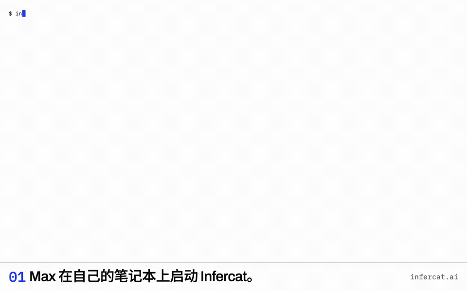

[English](README.md) · 简体中文

<picture>
  <source media="(prefers-color-scheme: dark)" srcset="docs/media/mark-paper.svg">
  
</picture>

# Infercat

**让朋友用你的 GPU 聊天。**

[](LICENSE)
[](https://github.com/infercat/infercat/actions/workflows/ci.yml)

---

把你电脑上的模型分享给朋友。在你现有的推理服务（llama.cpp、vLLM、Ollama 或 LM Studio）前面跑一个二进制程序，给每个朋友发一个邀请码。他们把邀请码粘贴到网页版就能和你的模型聊天：免账号、免 VPN、什么都不用装。连接全程端到端加密，中间的中继只能看到密文。你可以给每个朋友单独设置限额，只看得到数字，看不到他们聊了什么。



*真实运行录屏：朋友的浏览器通过中继连上一台运行 llama.cpp 的笔记本电脑。*

## 运行原理

- **主机**运行 `infercat serve`。它会自动找到推理服务，向中继建立一条 WireGuard 隧道，并在隧道内跑一个轻量网关：兼容 OpenAI 接口，一人一个密钥。
- **朋友**打开网页版，粘贴邀请码。网页版自带编译成 WebAssembly 的隧道客户端，浏览器可以直接连上你的主机——经由中继，全程端到端加密。
- **隧道**基于 [tailcat](https://github.com/tailscale/tailcat)，即 Tailscale 开源的数据面（去掉了控制面）。两端均无需账号。中继采用 DERP 服务器：默认使用公共中继，也可以自建（`--derpmap-url`）。Infercat 与 Tailscale Inc. 无关联，亦未获得其背书。

**先试试：**打开 https://infercat.ai/try 即可与我们的演示主机（Qwen3.8 27B）对话，无需安装。

## 快速上手（主机端）

你需要先启动一个推理服务（llama.cpp、vLLM、Ollama 或 LM Studio 均可；任何兼容 OpenAI `/v1/chat/completions` 的服务都能用）。朋友那边只要有个浏览器就行。

**可选——还没有推理引擎？** [安装 Ollama](https://ollama.com/download)，然后：

```sh
ollama serve &      # Ollama 应用已在运行的话可跳过
ollama run gemma4
```

会下载 Gemma 4（约 10 GB，需要 16 GB 内存，支持图片）并打开对话。保持运行或输入 `/bye`，引擎会继续运行。`infercat serve` 会自动找到它。

<a id="no-engine-yet"></a>
<details>
<summary><b>进阶引擎配置</b></summary>

同一个小模型，分别为 llama.cpp、Ollama、LM Studio 和 vLLM 调整上下文与并行处理位。

任选一个。这条命令会下载并启动一个小模型（Gemma 4 E2B，约 4 GB，8 GB 内存的笔记本也能跑，支持图片）：

**llama.cpp**

`brew install llama.cpp`

```sh
llama-server -hf unsloth/gemma-4-E2B-it-qat-GGUF:UD-Q4_K_XL -c 65536 -np 2 --host 127.0.0.1
```

**Ollama** — 下方启动 Infercat 时使用 `infercat serve --slots 2`。

`brew install ollama`

```sh
(OLLAMA_CONTEXT_LENGTH=32768 OLLAMA_NUM_PARALLEL=2 ollama serve & until ollama list >/dev/null 2>&1; do sleep 1; done; ollama run hf.co/unsloth/gemma-4-E2B-it-qat-GGUF:UD-Q4_K_XL "" && wait)
```

**LM Studio** — 下方启动 Infercat 时使用 `infercat serve --slots 2`。

[安装 LM Studio](https://lmstudio.ai/download)，并打开一次。

```sh
~/.lmstudio/bin/lms get https://huggingface.co/unsloth/gemma-4-E2B-it-qat-GGUF/resolve/main/gemma-4-E2B-it-qat-UD-Q4_K_XL.gguf --yes && ~/.lmstudio/bin/lms load gemma-4-e2b-it-qat --context-length 32768 --parallel 2 --yes && ~/.lmstudio/bin/lms server start --port 1234
```

**vLLM** — 未在 macOS 上验证；需要 CUDA 显卡

[安装 vLLM](https://docs.vllm.ai/en/latest/getting_started/installation/gpu/)

```sh
vllm serve google/gemma-4-E2B-it-qat-w4a16-ct --host 127.0.0.1 --max-model-len 32768 --max-num-seqs 2
```

</details>

```sh
curl -fsSL https://infercat.ai/install.sh | sh    # macOS 或 Linux
brew install infercat/tap/infercat                # 或用 Homebrew
```

- [安装脚本备用链接](https://raw.githubusercontent.com/infercat/infercat/main/hack/install.sh)。
- 其他平台请前往 [Releases](https://github.com/infercat/infercat/releases)；使用 `shasum -a 256 --ignore-missing -c infercat_<version>_checksums.txt` 校验。

如果解析不到最新版本（触发限流、暂无正式发布或网络问题），可以下载安装脚本后运行 `INFERCAT_VERSION=vX.Y.Z sh install.sh`。

接着：

```
infercat serve --name "Max's laptop"     # finds llama.cpp, Ollama, LM Studio or vLLM
infercat keys add alice                  # prints alice's invite once (and a QR code)
```

`serve` 会输出检测到的引擎、隧道地址、中继节点，以及朋友具体能访问哪些接口。`keys add` 会打印邀请——`serve` 时加了 `--web-url` 就打印成链接，否则是一串待粘贴的邀请码。通过任何方式发给 alice 即可；邀请码只显示一次，本地仅保存哈希值。

如果你的引擎运行在其他端口或另一台机器上：

```
infercat serve --upstream http://127.0.0.1:18080
```

传给 `serve` 的参数会保存在 `config.json` 中，下次直接运行 `serve` 即可，无需重复输入。

<details>
<summary><b>macOS 提示无法验证开发者</b></summary>

二进制文件目前尚未签名。macOS 第一次运行下载来的未签名程序时会拦住它。可以在终端中清除隔离标记后再运行：

```
xattr -d com.apple.quarantine ./infercat
```

或者在访达（Finder）中按住 Control 键点击该文件，选择**打开**并确认一次。通过 Homebrew 安装则不会遇到此问题。
</details>

<details>
<summary><b><code>serve</code> 全部参数</b></summary>

| `serve` 参数 | 说明 |
|---|---|
| `--upstream URL` / `--upstream-key TOKEN` | 你的推理服务地址（未指定时自动探测；`--upstream auto` 会清除已保存的地址） |
| `--name NAME` | 朋友看到的主机名称（默认：本机的主机名） |
| `--web-url URL` | 朋友打开网页版的地址；配置后邀请信息会直接打印为链接 |
| `--slots N` | 引擎可并发处理的请求数（0 = 自动询问引擎） |
| `--region NAME` / `--derpmap-url URL` | 偏好的中继区域 / 自建中继映射表地址 |
| `--dev-listen ADDR` | 额外在本地回环地址监听并放宽 CORS，用于前端开发 |
| `--log-prompts`、`--ephemeral`、`--verbose` | 单次运行选项：记录消息内容；临时主机身份；在终端打印隧道日志 |
| `--data-dir DIR` | 密钥、用量、配置和主机密钥的存放目录 |

运行 `infercat serve -h` 也能看到相同说明以及数据目录下的具体文件。
</details>

## 快速上手（朋友端）

打开 **[infercat.ai](https://infercat.ai)**，粘贴邀请码，点击 Connect。搞定。主机的 `keys add` 会把邀请打印成一个链接（还有二维码），点开就会打开网页版，邀请码已经填在输入框里，通常你只要点一下。

想自己托管网页版？它就是一个静态包：Releases 里的 `web-<version>.zip`，任意静态文件服务器，根目录下放 `index.html`：

```
unzip web-<version>.zip -d web && python3 -m http.server 8080 --directory web --bind 127.0.0.1
```

网页顶部会显示当前连接路径（`relayed via nyc · 64 ms`）、模型名称以及对应主机限额的已用额度。所有聊天记录都只留在你的浏览器本地。

## 朋友能访问什么

只能访问你推理服务上的 `/v1/models` 和 `/v1/chat/completions`（若引擎支持则包含 `/v1/embeddings`）——无法触碰你电脑上的其他任何内容：没有其他端口、没有文件、没有管理 API。隧道暴露出去的只有网关，别的什么都没有；`serve` 每次启动都会把这行打出来。

## 隐私

- 主机端**只记数字，不记文字**：每次请求在 `usage.jsonl` 中只记一行，包含密钥、接口、状态、token 计数和耗时。只有当主机显式指定 `serve --log-prompts` 时才会记录 prompt 和回复文本，而网页版在发送第一条消息前就会向朋友明确提示这一点。
- 中继端**只看密文**：从朋友的浏览器到主机设备之间全程采用 WireGuard 加密。目前浏览器流量一律经由中继转发（浏览器本身无法进行 NAT 打洞）；直连链路将随隧道库的 WebRTC 传输层一同推出。
- 邀请密钥只展示一次，本地仅保存**哈希值**。邀请码一旦泄露，执行一次 `keys rotate` 就能让旧码立刻失效。

## 每个朋友的限额

每个密钥从创建起就自带限额——除非主机主动放开，否则没有无限制这一说：

```
infercat keys add bob --rpm 6 --daily-tokens 50000          # tight, for a stranger
infercat keys limits alice --rpm 60 --daily-tokens 1000000 --max-output-tokens 8192
```

默认值：每分钟 20 次请求 · 每分钟 20 000 token · 同时 1 个请求 · 4096 输出 token · 引擎的上下文长度 · 每天 200 000 token · 全部模型。超额时返回带 `Retry-After` 的 `429`；突发请求超出引擎处理槽位时会短暂排队，随后返回 `503`——绝不会把引擎卡死。网页版会向每位朋友展示各自的用量仪表盘。

管理朋友：`keys list` · `keys pause alice`（在 `keys resume` 之前一律返回 403）· `keys revoke alice`（永久撤销，会先问你一次）· `keys rotate alice`（换一个新邀请码，旧的失效）。查看状态：`status`（实时状态）与 `usage`（历史用量）。所有调整在运行中的主机上即时生效。

## 常见问题

**主机端需要注册账号吗？** 不需要。`serve` 会在数据目录生成一个主机身份标识，这就是全部的注册流程。**朋友端需要吗？** 也不需要——邀请码本身就是凭证。

**有哪些数据会经过你们的服务器？** 只有中继流量，而且全都是密文：DERP 服务器只负责在朋友的浏览器与你的主机之间转发加密数据包。默认使用隧道库映射表中的公共中继；通过 `--derpmap-url` 可以指定你自己的自建中继。

**除了网页版，能用其他客户端吗？** 网关兼容 OpenAI 接口，因此任何能带 bearer token 访问 `/v1/chat/completions` 的客户端，都能在隧道内使用。或者干脆不用浏览器：`infercat connect` 能把邀请码直接变成本地的 `http://127.0.0.1:11435/v1` 接口，任何应用都能调用（见下文的快速上手）。

**两个人共用一个邀请码行不行？** 能用，受那个密钥的限额约束，在 `usage` 里也看得见。建议一人一个密钥，反正不花钱。

**电脑休眠了怎么办？** 朋友端会提示“Max's laptop didn't answer”并说明原因；主机恢复后，网页版会自动重试。

**支持哪些模型？** 取决于你本地引擎跑什么模型；给密钥加上 `--models` 参数可以限制该朋友能选择的模型范围。

## 项目状态：Beta

核心功能均已跑通并经过测速（`docs/MEASURE.md`：经中继传输约 160 tokens/s，浏览器首字延迟 110–160 ms）。坦白说，目前还有这些已知限制：浏览器流量目前一律走中继；macOS 二进制文件尚未签名（见上文）；一台主机对应一个引擎；默认的公共中继有限流，而且随时可能被撤销，所以超出演示用途就该自建中继。各层的负载上限正在测，结果记在 `docs/MEASURE.md`，并会在 `docs/LIMITS.md` 里用大白话讲清楚。
<!-- TODO(028): link docs/LIMITS.md when it lands -->

## 快速上手（朋友端 · 用自己的应用）

无需浏览器：同一个二进制文件可以直接把邀请码变成一个本地的 OpenAI 兼容接口。这样一来，Open WebUI、Cursor、Claude Code、OpenAI SDK 乃至直接用 `curl` 都能像调用本地模型一样使用朋友的模型。两台电脑一旦找到彼此，链路就会转成直连；中继只是它们碰头的地方。

```
bin/infercat connect ic1.tc….…          # paste the invite
```
```
Infercat 0.1.0
host      Max's laptop  ·  gemma-4-E2B-it-Q4_K_M.gguf
path      relayed via New York City · 27 ms       # re-checked every 30 s, printed when it changes
local     http://127.0.0.1:11435
          set your app's base URL to http://127.0.0.1:11435/v1, any API key
```

邀请码中自带的密钥会自动附加到每次请求中；调用应用自身填写的 API key 会被忽略。只转发 `/v1/*` 和 `/me`，其他一律不转发。报错信息会保留主机的状态与错误码，并用通俗语言提示应对方法（已暂停、已撤销、主机休眠、触发限流并带 `Retry-After`、主机繁忙）；当主机失去响应时，`connect` 会给出明确提示并自动尝试重连。

```
OPENAI_BASE_URL=http://127.0.0.1:11435/v1 OPENAI_API_KEY=x python3 -c '
from openai import OpenAI; c = OpenAI()
for e in c.chat.completions.create(model=c.models.list().data[0].id, messages=[{"role":"user","content":"hi"}], stream=True):
    print(e.choices[0].delta.content or "", end="", flush=True)'
```

## 数据目录

详见[数据目录](docs/DATA-DIRECTORY.zh-CN.md)：存储路径、文件用途与备份说明。

## 编译构建

构建与发布检查见[贡献指南](CONTRIBUTING.md#building)，前端说明见 [web README](web/README.zh-CN.md)。

## 开源协议

MIT — 详见 [LICENSE](LICENSE)。基于 Tailscale 的开源库 [tailcat](https://github.com/tailscale/tailcat) 构建（Infercat 与 Tailscale Inc. 无关联，亦未获得其背书；见上文）。tailcat 采用 BSD-3 协议；所有依赖项的开源协议均列在 [THIRD_PARTY_NOTICES.md](THIRD_PARTY_NOTICES.md) 中。安全漏洞提报：[SECURITY.md](SECURITY.md)。贡献指南：[CONTRIBUTING.md](CONTRIBUTING.md)。

Made by [2185 Lab](https://2185lab.com). MIT.
